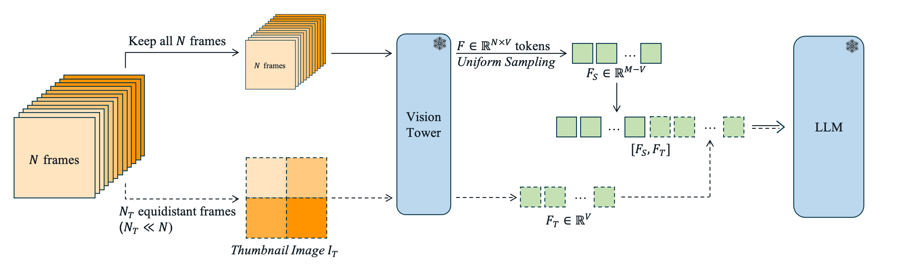

# TS-LLaVA

**First version of the code has been released.**

This is the official implementation for [TS-LLaVA: Constructing Visual Tokens through Thumbnail-and-Sampling for Training-Free Video Large Language Models](https://arxiv.org/abs/2411.11066)

by [Tingyu Qu](https://tingyu215.github.io), [Mingxiao Li](https://mingxiao-li.github.io), [Tinne Tuytelaars](https://www.esat.kuleuven.be/psi/TT), [Marie-Francine Moens](https://people.cs.kuleuven.be/~sien.moens/).





We explore various visual tokens compression strategies. Our TS-LLaVA achieves the state-of-the-art performance among trianing-free video LLMs.


## Table of contents
- [Results](#results)
- [Installation](#installation)
- [Dataset Preparation](#dataset-preparation)
- [Inference and Evaluation](#inference-and-evaluation)
    - [Output Structures](#output-structures)
- [Citations](#citations)


## Results
#### Multiple Choice VideoQA:
[](https://paperswithcode.com/sota/zero-shot-video-question-answer-on-intentqa?p=ts-llava-constructing-visual-tokens-through)

[](https://paperswithcode.com/sota/zero-shot-video-question-answer-on-next-qa?p=ts-llava-constructing-visual-tokens-through)

[](https://paperswithcode.com/sota/zero-shot-video-question-answer-on-egoschema?p=ts-llava-constructing-visual-tokens-through)


#### Multitask Benchmarks

**Ranked #10: the average accuracy for multple choice questions on MLVU-test**


#### Open-Ended VideoQA & Video-based Text Generation

[](https://paperswithcode.com/sota/zeroshot-video-question-answer-on-tgif-qa?p=ts-llava-constructing-visual-tokens-through)


[](https://paperswithcode.com/sota/zeroshot-video-question-answer-on-activitynet?p=ts-llava-constructing-visual-tokens-through)

[](https://paperswithcode.com/sota/zeroshot-video-question-answer-on-msrvtt-qa?p=ts-llava-constructing-visual-tokens-through)

[](https://paperswithcode.com/sota/zeroshot-video-question-answer-on-msvd-qa?p=ts-llava-constructing-visual-tokens-through)


[](https://paperswithcode.com/sota/video-based-generative-performance?p=ts-llava-constructing-visual-tokens-through)


## Installation

### Building the environment
To create conda env, please run:

    conda env create -n llava --file llava.yml
    conda activate llava

* Two packages, i.e. llava and flash-attention, are commented out from the yml file, as direct installation can cause problems. Please refer to [the original LLaVA repo](https://github.com/haotian-liu/LLaVA) for installing them.
* One can also directly follow the installation process as recorded in [the original LLaVA repo](https://github.com/haotian-liu/LLaVA).

### Downloading the checkpoints:
The checkpoints for LLaVA-v1.6 can be found here:
    
    git lfs clone https://huggingface.co/liuhaotian/llava-v1.6-vicuna-7b .ckpt/llava-v1.6-vicuna-7b
    git lfs clone https://huggingface.co/liuhaotian/llava-v1.6-34b .ckpt/llava-v1.6-34b

* After downloading, the checkpoints should be stored in the ckpt folder.

\[Optional] To enable GPT evaluation for open-ended video QA, please do the following:

    export OPENAI_API_KEY=$YOUR_OPENAI_API_KEY

## Dataset preparation

### Multiple Choice VideoQA and Open-Ended VideoQA

1. We prepare the ground-truth question and answer files based on [`IG-VLM`](https://github.com/imagegridworth/IG-VLM/tree/main) and [`SF-LLaVA`](https://github.com/apple/ml-slowfast-llava/tree/main), and put them under [playground/gt_qa_files](playground/gt_qa_files).

    - **NExT-QA**:  Download the `NExT_QA.csv` from [`here`](https://github.com/imagegridworth/IG-VLM/blob/main/data/multiple_choice_qa/NExT_QA.csv)
    - **EgoSchema**: Download the `EgoSchema.csv` from [`here`](https://github.com/imagegridworth/IG-VLM/blob/main/data/multiple_choice_qa/EgoSchema.csv)
    - **IntentQA**: Download the `IntentQA.csv` from [`here`](https://github.com/imagegridworth/IG-VLM/blob/main/data/multiple_choice_qa/IntentQA.csv)
    
    If you want to run our model for Open-Ended VideoQA and video-based Text Generation, please download the datasets as:
    - **MSVD-QA**: Download the `MSVD_QA.csv` from [`here`](https://github.com/imagegridworth/IG-VLM/blob/main/data/open_ended_qa/MSVD_QA.csv)
    - **MSRVTT-QA**: Download the `MSRVTT_QA.csv` from [`here`](https://github.com/imagegridworth/IG-VLM/blob/main/data/open_ended_qa/MSRVTT_QA.csv)
    - **TGIF-QA**: Download the `TGIF_FrameQA.csv` from [`here`](https://github.com/imagegridworth/IG-VLM/blob/main/data/open_ended_qa/TGIF_FrameQA.csv)
    - **Activitynet-QA**: Download the `Activitynet_QA.csv` from the [`here`](https://github.com/imagegridworth/IG-VLM/blob/main/data/open_ended_qa/ActivityNet_QA.csv)
    - **VCGBench**
        - Download all files under [`text_generation_benchmark`](https://github.com/imagegridworth/IG-VLM/blob/main/data/text_generation_benchmark)
        - Reformat the files by running
            ```
            python scripts/data/prepare_vcgbench_qa_file.py --qa_folder $TEXT_GENERATION_BENCHMARK
            ```
2. Reformatting the files:
    - After getting the csv files, please reformat the files (apart from VCGBench) by running
        ```
        python scripts/data/prepare_{DATASET}_file.py --qa_file $PATH_TO_CSV_FILE
        ```
    - replace DATASET with the names of the dataset. Check the ``scripts/data`` to make sure the name is correct.

3. Download the raw videos from the official websites.

    - Multiple Choice VideoQA

        - Download datasets from the data owners.
            - [`NExT-QA`](https://github.com/doc-doc/NExT-QA)
            - [`EgoSchema`](https://egoschema.github.io)
            - [`IntentQA`](https://github.com/JoseponLee/IntentQA)

    - Open-Ended VideoQA & video-based Text Generation:

        - [Recomanded] Option 1: Follow the instruction in [`Video-LLaVA`](https://github.com/PKU-YuanGroup/Video-LLaVA/blob/main/TRAIN_AND_VALIDATE.md) to download raw videos.
        - Option 2: Download videos from the data owners.
            - [`MSVD-QA`](https://github.com/xudejing/video-question-answering?tab=readme-ov-file)
            - [`MSRVTT-QA`](https://github.com/xudejing/video-question-answering?tab=readme-ov-file)
            - [`TGIF-QA`](https://github.com/YunseokJANG/tgif-qa?tab=readme-ov-file)
            - [`ActivityNet-QA`](https://github.com/MILVLG/activitynet-qa)
    
    - Store the videos to the dir of your choice (``BASE_VIDEO_DIR``), and replace ``BASE_VIDEO_DIR`` in scripts when needed


### Multitask Benchmarks

1. Download the data:
    - MVBench
        - Download the data from [`here`](https://huggingface.co/datasets/OpenGVLab/MVBench)
        - The official repo can be found [`here`](https://github.com/OpenGVLab/Ask-Anything)

    - MLVU
        - Download the data from [`here`](https://huggingface.co/datasets/MLVU/MVLU)
        - The official repo can be found [`here`](https://github.com/JUNJIE99/MLVU)
    
    - Store the videos in ``BASE_VIDEO_DIR``


## Inference and Evaluation


* By default, we use all the visible GPUs on the node for the model inference. To manually select GPUs, please modify ``CUDA_VISIBLE_DEVICES`` in the scripts accordingly.
* Please note that the model inference of TS-LLaVA-34B requires GPUs with at least 80G memory.
* In each scripts, change ``CKPT_NAME`` and ``model_path`` accordingly.


### Multiple Choice VideoQA

    cd scripts/infer_videos
    bash run_qa_{DATASET_NAME}.sh {AGGREGATION_METHOD} {NUM_FRAMES} {NUM_SAMPLED_TOKENS} {PROMPT_VERSION} {IMAGE_ASPECT_RATIO}
    The evaluation is automatically done after inference

* replace DATASET_NAME to one of {nextqa, egoschema, intentqa}
* ``AGGREGATION_METHOD`` refers to the visual token compression method of choice. The default for TS-LLaVA is ``V2``, you can select from
    * ``X1``, ``X2``, ``X3``: only use the thumbnail image.
    * ``Z1``, ``Z2``, ``Z3``: using multiple thumbnail images. (remember to sed the total number of frames divisible to the number of frames per thumbnail image)
    * ``Y1``, ``Y2``, ``Y3``: use both thumbnail image and sampled visual tokens. And prepend thumbnail image tokens to sampled visual tokens.
    * ``V1``, ``V2``, ``V3``: similar as ``Y1``, ``Y2``, ``Y3``. But sampled tokens are prepended to thumbnail image tokens.
    * ``W1``, ``W2``, ``W3`` \& ``U1``, ``U2``, ``U3``: using multiple thumbnail images with sampled visual tokens (for ablation studies, remember to set the number of sample tokens accordingly).
    * Here 1, 2 and 3 correspond to using 4, 6, and 8 frames per thumbnail image, respectively.
    * For details, please refer to llava_arch.py
* ``NUM_FRAMES`` refers to the total number of frames used. The default for TS-LLaVA is 50.
* ``NUM_SAMPLED_TOKENS`` refers to the number of sampled tokens. The default for TS-LLaVA is 2880.
* ``PROMPT_VERSION`` refers to the textual prompt version used. The default for TS-LLaVA is ``v4``. Please refer to get_prompt.py for more information
* ``IMAGE_ASPECT_RATIO`` refers to the type of image aspect ratio. The default for TS-LLaVA is ``resize``, which resizes each frame to 336$\times$336.


### Multitask Benchmarks
The default arguments ``AGGREGATION_METHOD``, ``NUM_FRAMES``, ``NUM_SAMPLED_TOKENS``, ``PROMPT_VERSION`` and ``IMAGE_ASPECT_RATIO`` are the same as Multiple Choice VideoQA.

#### MLVU
    cd scripts/infer_videos
    bash run_qa_mlvu_mcqa.sh V2 50 2880 v4 resize
    Submit the resulting json file to the official evaluation server (https://github.com/JUNJIE99/MLVU) for evaluation 

#### MVBench
    cd scripts/infer_videos
    bash run_qa_mlvu_mcqa.sh V2 50 2880 v4 resize {INPUT_FORMAT}
    The evaluation is automatically done after inference

* In the script, change ``video_dir``, ``gt_file_qa`` and ``output_dir`` accordingly for different subtasks.
* The sixth argument ``INPUT_FORMAT`` refers to the input format of visual contents, which corresponds to the subtask of choice. It should be either ``video`` or ``image``.


### Open-Ended VideoQA
The default value for ``PROMPT_VERSION`` is ``v3``. The rest are the same as Multiple Choice VideoQA.

#### Inference

    cd scripts/infer_videos
    bash run_qa_{DATASET_NAME}.sh V2 50 2880 v3 resize
* Same as Multiple Choice VideoQA. Replace DATASET_NAME to one of {msvd, msrvtt, anet, tgif}


#### Evaluation

    cd scripts/eval
    bash eval_{DATASET_NAME}.sh V2 50 2880 v3 resize {API_KEY}

* Use your own api_key from openai for ``API_KEY``.

**For VCGBench (Video ChatGPT), the inference and evaluation procedures are similar. Please refer to run_gen_qa_{TASK_TYPE}.sh and eval_gen_qa.sh**


## Citations

    @article{qu2024tsllava,
    title={TS-LLaVA: Constructing Visual Tokens through Thumbnail-and-Sampling for Training-Free Video Large Language Models}, 
    author={Tingyu Qu and Mingxiao Li and Tinne Tuytelaars and Marie-Francine Moens},
    year={2024},
    journal={arXiv preprint arXiv:2411.11066},
    }